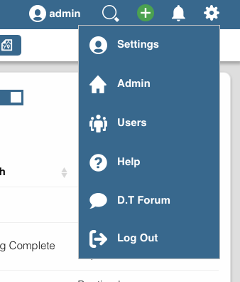
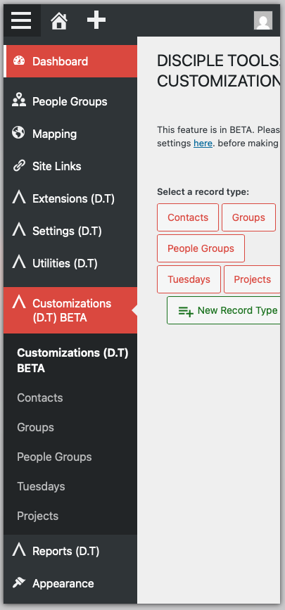

# Accessing the Customizations Menu

`WP Admin > Customizations (D.T)`

__Accessing From The Frontend__

1. Log in to your Disciple.Tools frontend with administration privileges.
2. Navigate to the WordPress Admin dashboard of your Disciple.Tools instance.
    - Click the settings icon (⚙️ on desktop, ☰ on mobile) and select **Admin**.

    

3. From the main left sidebar, click on **Customizations (D.T)**.

    

__Accessing WordPress Admin Dashboard Directly__

1. Log in directly to the WordPress Admin Dashboard `/wp-admin/` endpoint as an administrator.
2. As described above in step 3; From the main left sidebar, click on **Customizations (D.T)**.