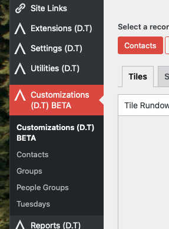

# Accessing the Customizations Menu

`WP Admin > Customizations (D.T) BETA`

__On Desktop__ - To access the Customizations menu directly:

1. Log in to your Disciple.Tools instance as an administrator.
2. In the left sidebar, click on **Customizations (D.T)**.

__On Mobile__ - When accessing the Customizations menu directly via a mobile view, the flow would be as follows:

1. Log in to your Disciple.Tools instance as an administrator.
2. Click on the hamburger button (☰) in the top left-hand corner; to expand the menu sidebar.
3. In the recently exapnded left sidebar, click on **Customizations (D.T)**.

Alternatively, when accessing the Customizations menu from the frontend, the flow would be as follows:

1. Log in to your Disciple.Tools frontend as an administrator.
2. Click on the cog button in the top right-hand corner (top left-hand hamburger button in mobile views), to display menu.
3. From the displayed menu, click on the `Admin` option, to navigate into administration area.
4. In the left sidebar, click on **Customizations (D.T)**, as described in the above sections.

> If you do not see this menu, you may not have the required permissions. 
> 
> Roles & permissions can be found at the following location:
>
>`WP Admin > Settings (D.T) > Roles`