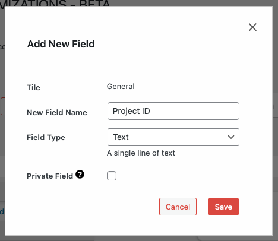

# Adding a New Field

To add a new field:

1. Expand a tile by clicking the plus sign (+) next to its name.
2. Click **add new field** at the bottom of the expanded tile.
3. Fill in the field details:
   - **Field Name**: Display name for the field
   - **Field Type**: Type of data the field will store
   - Additional settings specific to the field type
4. Click **Create Field** to add the new field.

---

- [Modifying Existing Fields →](./modifying.md)