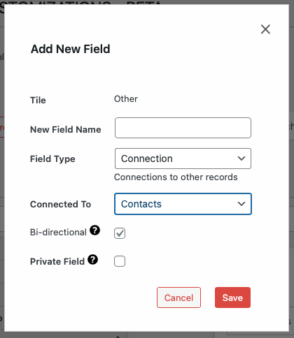
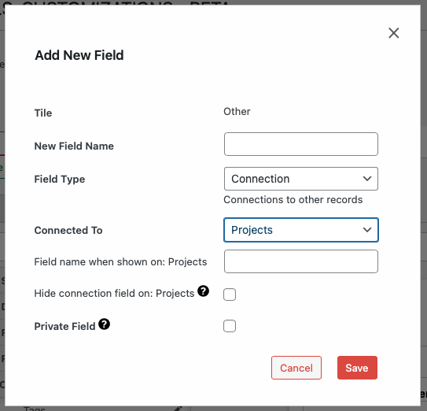

# Adding a New Field

## Accessing Add New Field Functionality

`WP Admin > Customizations (D.T) BETA > [Record Type] > Tiles > [Tile] > Add New Field`

__On Desktop__

1. Access the customizations feature, as described within [Accessing Menu](../accessing-menu.md)
2. Identify and select record type to be updated.
3. Navigate to `Tiles` tab.
4. Identify tile where field is to be added and click on tile to expand and display field list.
5. Click `add new field` option at the end of field list.

__On Mobile__

1. Access the customizations feature, as described within [Accessing Menu](../accessing-menu.md)
2. Identify and select record type to be updated.
3. Navigate to `Tiles` tab.
4. Identify tile where field is to be added and click on tile to expand and display field list.
5. Click `add new field` option at the end of field list.

## Adding New Field Workflow

To add a new field:

1. Expand a tile by clicking the plus sign (+) next to its name.
2. Click **add new field** at the bottom of the expanded tile.
3. Fill in the field details; which typically include:
   - **New Field Name**: Display name for the field.
   - **Field Type**: Type of data the field will store.
   - **Private Field**: Field will only be visible to owner.
   - Additional settings specific to the field type.
      - See following section for examples of additional settings by relevant field types.
4. Click **Save** to add the new field.

## Additional Settings By Field Type

__Connection Field Type__

Supports relational connections with other record types, with the following additional settings.

- **Connected To**: Record type which new field will establish a connection with.
- **Bi-directional**: If checked, relationship to be established operates in both directions between records. If unchecked, then relationship direction enforced between parent to child.
- **Field Name When Shown**: Field name label to be shown within target record type.
- **Hide Connection Field**: If checked, connection field to be hidden within target record type.

---

- [Modifying Existing Fields →](./modifying.md)