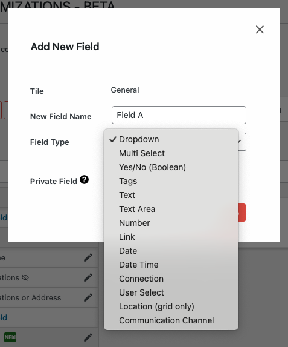

# Understanding Field Types

Disciple.Tools offers a variety of field types to capture different kinds of information. When adding a new field, you can choose the type that best fits your data.

## Common Field Types

- **Text**: Single-line text input
- **Textarea**: Multi-line text for longer content
- **Number**: Numeric values only
- **Date**: Date selector
- **Key Select**: Dropdown with predefined options
- **Multi-Select**: Multiple selections from predefined options
- **Tags**: User-creatable tags for flexible categorization
- **Connection**: Relationship to other record types
- **User Select**: Select users from your Disciple.Tools instance
- **Location**: Geographic location selection
- **Communication Channel**: Contact methods like phone, email, etc.
- **Boolean**: True/false toggle
- **Link**: Web links with categories

---

- [Adding a New Field →](./adding.md) 