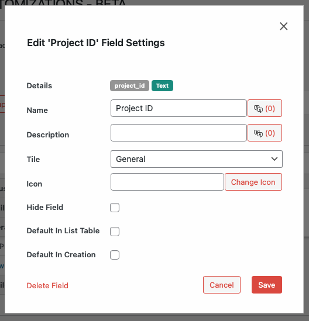

# Modifying Existing Fields

You can update the label, description, icon, tile assignment, and visibility of any field.

To edit an existing field:

1. Expand the tile containing the field.
2. Click on the edit icon next to the field name.
3. Update the field details as needed:
   - **Field Name**: Change the display name for the field and optionally specify translation.
   - **Description**: Update the help text and optionally specify translation.
   - **Tile**: Move the field to a different tile.
   - **Icon**: Change or add an icon for the field.
   - **Hide Field**: Hide the field without deleting it.
   - **Show in List Table**: Display the field in the list view.
   - **Default in Creation**: Show the field by default when creating a new record.
4. Click **Update Field** to save your changes.

---

- [Reordering Fields →](./reordering.md) 