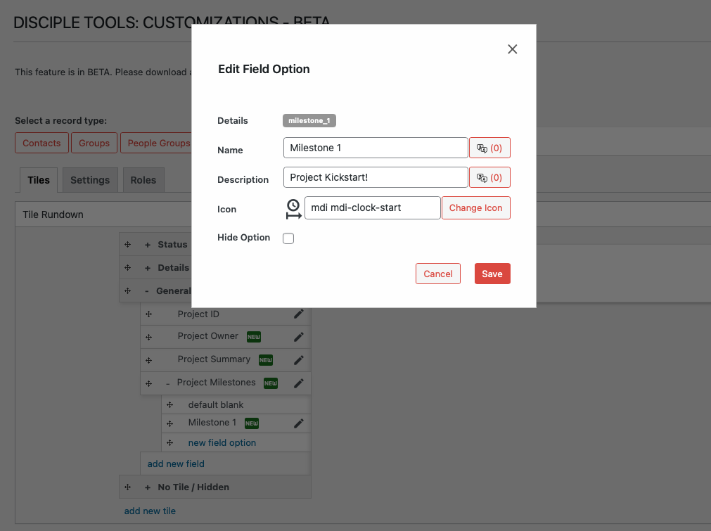

# Field Options

## Accessing Field Options Functionality

`WP Admin > Customizations (D.T) > [Record Type] > Tiles > [Tile] > [Field] > Field Option`

To access the field options functionality, follow these steps:

1. Navigate to the WordPress Admin dashboard of your Disciple.Tools instance.
   - Click the settings icon (⚙️ on desktop, ☰ on mobile) and select **Admin**.
2. From the main left sidebar, click on **Customizations (D.T)**.
3. Identify and select record type to be updated.
4. Navigate to `Tiles` tab.
5. Identify tile containing existing field to be updated.
6. Expand tile field list and click on relevant (key-select or multi-select) field, to expand options list.
7. Either add or edit target option.

## Field Option Workflow

For **Key Select** and **Multi-Select** fields, you can manage the available options that users can select from.

To manage field options:

1. Expand the field by clicking the plus sign (+) next to its name.
2. View existing options or add new ones by clicking **new field option**.
3. For each option, you can set:
   - **Details Key**: Internal identifier.
   - **Option Name**: Display name, with optional translation.
   - **Option Description**: Description summary of option, with optional translation.
   - **Icon**: Optional icon for the option.
   - **Hide Option**: Hide the option without deleting it.
4. Options can be reordered using drag and drop.

 