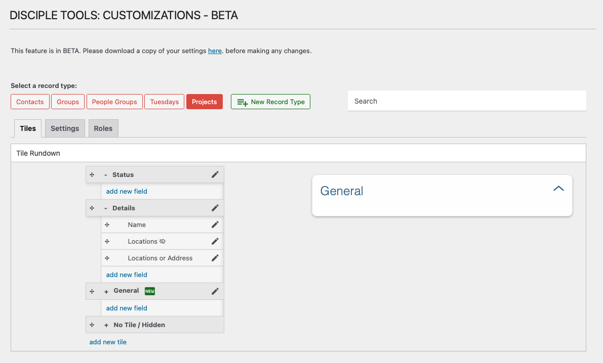

# Fields Overview

Fields are the individual data elements that store information within each record in Disciple.Tools. Fields are grouped into tiles and can be customized for each record type.

## What is a Field?

A field is a specific piece of information you want to track, such as a name, phone number, date, or custom value. Each field has a type, label, and other settings.

- **Examples:** Name, Email, Status, Notes, Custom Attributes
- Fields appear as input areas or display values on the record details page.

## Why Use Custom Fields?

- Capture the exact information your ministry needs
- Organize data for better reporting and workflows
- Tailor each record type to your unique requirements

---

- [Understanding Field Types →](./field-types.md) 