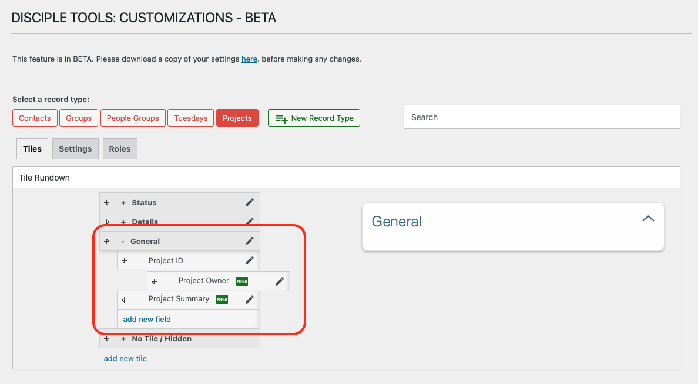

# Reordering Fields

## Accessing Field Reordering Functionality

`WP Admin > Customizations (D.T) BETA > [Record Type] > Tiles > [Tile]`

__On Desktop__

1. Access the customizations feature, as described within [Accessing Menu](../accessing-menu.md)
2. Identify and select record type to be updated.
3. Navigate to `Tiles` tab.
4. Identify tile to be updated and click on tile to expand and display field list.
5. Drag and drop fields accordingly to reorder.

__On Mobile__

1. Access the customizations feature, as described within [Accessing Menu](../accessing-menu.md)
2. Identify and select record type to be updated.
3. Navigate to `Tiles` tab.
4. Identify tile to be updated and click on tile to expand and display field list.
5. Drag and drop fields accordingly to reorder.

## Reordering Fields Workflow

You can change the order of fields within a tile to control how information is displayed on the record details page.

To reorder fields:

1. Expand the tile containing the fields.
2. Hover over a field to see the drag handle (four-arrow icon).
    - On mobile devices, simply press down on field panel.
3. Click and hold the drag handle.
4. Drag the field to the desired position within the tile.
5. Release to drop the field in the new position.

> **Tip:** The order of fields affects the layout for all users viewing this record type.

---

- [Field Options →](./options.md) 