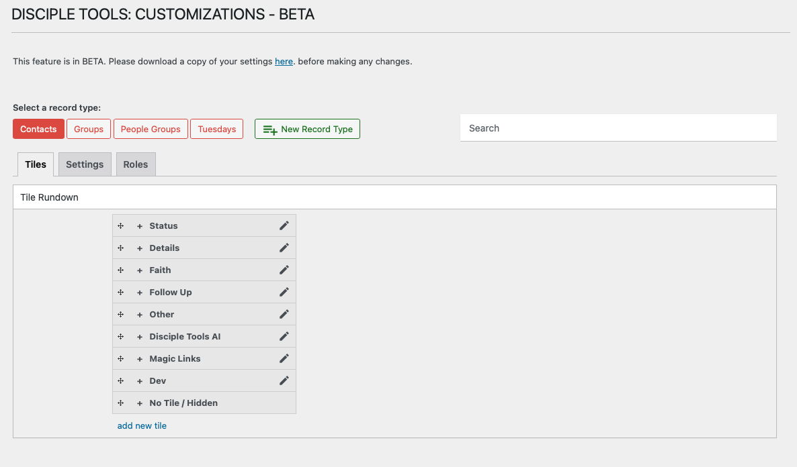

# Introduction to Admin Customization (D.T) Section

The Admin Customization (D.T) Section in Disciple.Tools empowers administrators to adapt the platform to their ministry’s workflow—without needing technical skills or developer support.

## Who Should Use This?

- **Administrators** of a Disciple.Tools site who want to tailor the platform for their team or ministry.
- Users with the **“Customizations (D.T)”** menu available in their admin sidebar.

## What Can You Customize?

- **Record Types:** Define new types of records (e.g., Projects, Events) in addition to the built-in Contacts and Groups.
- **Tiles:** Organize fields into logical sections (tiles) on each record’s details page.
- **Fields:** Add, edit, or remove fields to capture the exact information you need.
- **Roles & Permissions:** Control which user roles can view, create, edit, or delete each record type.
- **Search Settings:** Adjust how custom data can be searched and filtered (where supported).

## Why Use Customizations?

- Streamline your team’s workflow
- Ensure you’re capturing the right information
- Provide a tailored experience for different user roles
- Adapt Disciple.Tools as your ministry grows

> For details on accessing the Customizations menu, see [Accessing the Customizations Menu](./accessing-menu.md). 