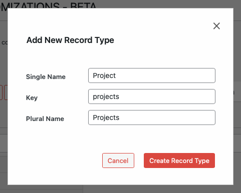

# Creating a New Record Type

## Accessing New Record Type Functionality

`WP Admin > Customizations (D.T) > New Record Type`

To access the new record type functionality, follow these steps:

1. Navigate to the WordPress Admin dashboard of your Disciple.Tools instance.
   - Click the settings icon (⚙️ on desktop, ☰ on mobile) and select **Admin**.
2. From the main left sidebar, click on **Customizations (D.T)**.
3. `New Record Type` button located at top of page.

## New Record Type Workflow

1. Go to the **Customizations (D.T)** menu in the admin sidebar.
2. At the top of the page, click the **New Record Type** button.
3. Fill in the required information:
   - **Key**: The internal identifier for the record type (no spaces, lowercase)
   - **Singular Label**: How the record type will be displayed in singular form (e.g., "Project")
   - **Plural Label**: How the record type will be displayed in plural form (e.g., "Projects")
4. Click **Create** to add the new record type.

> **Tip:** Choose a clear and descriptive key, as it cannot be changed later.

---

- [Modifying Record Type Settings →](./modifying.md) 