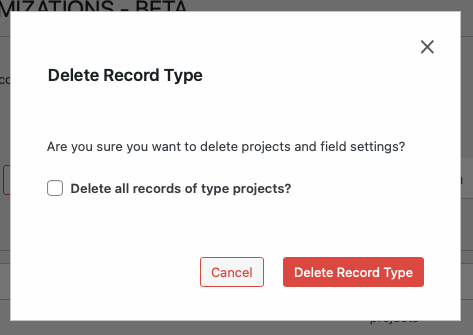

# Deleting a Record Type

> **Warning:** Deleting a record type will permanently delete all records of that type. This action cannot be undone.

## Accessing Record Type Delete Functionality

`WP Admin > Customizations (D.T) > [Record Type] > Settings > Delete`

To access the record type delete functionality, follow these steps:

1. Navigate to the WordPress Admin dashboard of your Disciple.Tools instance.
   - Click the settings icon (⚙️ on desktop, ☰ on mobile) and select **Admin**.
2. From the main left sidebar, click on **Customizations (D.T)**.
3. Identify and click on Record Type button located at top of page.
4. Navigate to `Settings` tab.
5. The Delete button can be located at the bottom of tab view.

## Delete Record Type Workflow

To delete a custom record type:

1. Go to the **Customizations (D.T)** menu and select the record type you want to delete.
2. Click the **Settings** tab.
3. Scroll to the bottom and click the **Delete** button.
4. Confirm the deletion in the popup dialog.

> **Note:** You may also have the option to delete all records of this type. Use this with caution. 