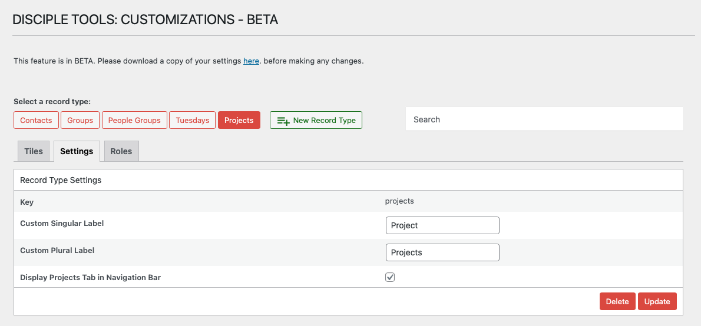

# Modifying Record Type Settings

## Accessing Record Type Editing Functionality

`WP Admin > Customizations (D.T) BETA > [Record Type] > Settings`

__On Desktop__

1. Access the customizations feature, as described within [Accessing Menu](../accessing-menu.md)
2. Identify and click on Record Type button located at top of page.
3. Navigate to `Settings` tab.

__On Mobile__

1. Access the customizations feature, as described within [Accessing Menu](../accessing-menu.md)
2. Identify and click on Record Type button located at top of page.
3. Navigate to `Settings` tab.

## Modifying Record Type Workflow

You can update the display labels and navigation settings for any record type.

To modify an existing record type:

1. In the **Customizations (D.T)** menu, click on the record type pill at the top of the page.
2. Click the **Settings** tab.
3. Update the following fields as needed:
   - **Custom Singular Label**: Change how the record type is displayed in singular form
   - **Custom Plural Label**: Change how the record type is displayed in plural form
   - **Display Tab in Navigation Bar**: Show or hide this record type in the main navigation
4. Click **Update** to save your changes.

---

- [Deleting a Record Type →](./deleting.md) 