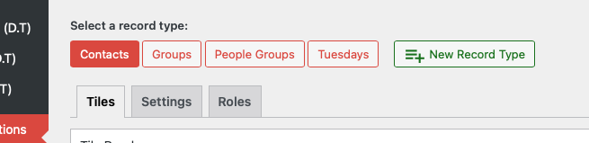

# Record Types Overview

Record types are the primary data categories in Disciple.Tools, such as Contacts and Groups. With the Admin Customization (D.T) Section, you can create new record types to match your ministry’s unique needs (for example, Projects, Events, or any custom category).

## What is a Record Type?

A record type defines a set of fields and tiles that organize information for a specific kind of data. Each record type can have its own layout, fields, and permissions.

- **Examples:** Contacts, Groups, Projects, Events
- **Custom record types** allow you to track new types of information beyond the built-in options.

## Why Use Custom Record Types?

- Organize your data more effectively
- Tailor Disciple.Tools to your ministry’s workflow
- Control which users can access or modify each type

---

- [Creating a New Record Type →](./creating.md) 