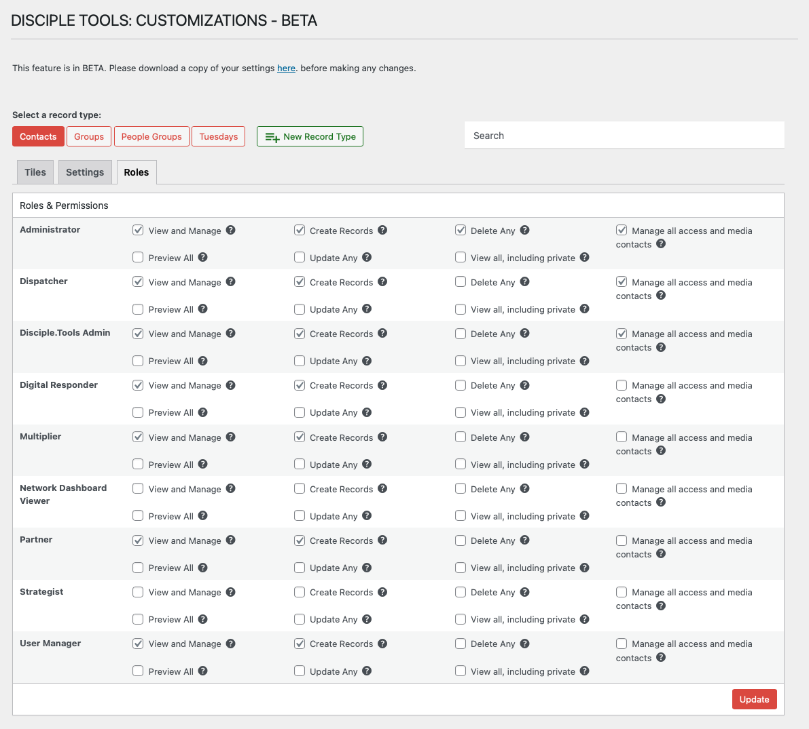

# Role Permissions

Role permissions allow you to control which user roles can view, create, edit, or delete each record type in Disciple.Tools. This helps you tailor access to sensitive information and ensure users only see what’s relevant to their role.

## Accessing Role Permissions Functionality

`WP Admin > Customizations (D.T) > [Record Type] > Roles`

To access the role permissions functionality, follow these steps:

1. Navigate to the WordPress Admin dashboard of your Disciple.Tools instance.
   - Click the settings icon (⚙️ on desktop, ☰ on mobile) and select **Admin**.
2. From the main left sidebar, click on **Customizations (D.T)**.
3. Select record type to be updated.
4. Navigate to `Roles` tab.
5. Un/Check role permissions accordingly, based on requirements. 
6. Click update button to save changes.

## What Are Role Permissions?

Each user in Disciple.Tools is assigned a role (such as Administrator, DT Admin, or custom roles). For each record type, you can specify what actions each role is allowed to perform:

- **View and Manage**: Grants basic access to the record type's user interface and allows users to manage records they have permission to view. This is the foundational permission required to interact with any record type. Without this permission, users cannot access the record type's pages or features.
- **Create Records**: Allows users to create new records of the specified type. Users with this permission can add new contacts, groups, or custom records to the system.
- **Delete Any**: Permits deletion of any record of the specified type, regardless of assignment or sharing permissions. This is a powerful permission that bypasses normal ownership restrictions.
- **Manage all access and media contacts**: A contact-specific permission that allows viewing and updating all standard/access type contacts and media contacts. This is useful for administrators who need to manage system-level contact records.
- **Preview All**: Enables viewing record lists and basic information for search purposes without accessing full record details. This permission is particularly useful for typeahead searches and dropdown selections where users need to see record names but not sensitive details.
- **Update Any**: Allows editing any record of the specified type, bypassing normal assignment and sharing restrictions. Users with this permission can modify any record regardless of whether they are assigned to it or have been granted specific sharing access.
- **View all, including private**: Grants access to view any record of the specified type, including private/personal records that would normally be restricted. For contacts, this specifically includes private contacts that other users cannot typically see.

## Permission Hierarchy

Permissions follow a hierarchical structure:

1. **Basic Access** (`View and Manage`) is required for any interaction with a record type
2. **Specific Actions** (`Create`, `Update`, `Delete`) are checked in addition to basic access
3. **"Any" Permissions** (`Update Any`, `Delete Any`, `View All`) bypass normal sharing restrictions
4. **Preview Permission** allows limited access for search functionality without full record access

## Why Manage Role Permissions?

- Protect sensitive information
- Simplify the user experience by hiding irrelevant features
- Ensure only authorized users can make changes

## How to Configure Role Permissions

1. Select a record type from the top of the Customizations page.
2. Click on the **Roles** tab.
3. For each role, check or uncheck the permissions you want to grant:
   - View, Create, Update, Delete, and others as available
4. Click **Update** to save your changes.

> **Tip:** Review permissions regularly to ensure your data remains secure and accessible to the right people. 