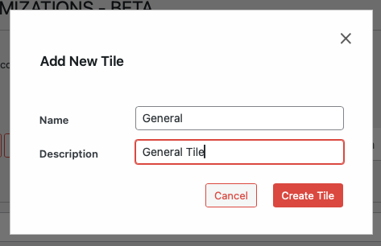

# Creating a New Tile

To create a new tile:

1. Select a record type from the top of the Customizations page.
2. At the bottom of the tiles list, click **add new tile**.
3. Fill in the tile details:
   - **Name**: Display name for the tile
   - **Description**: Summary description of new tile
4. Click **Create Tile** to add the new tile.

---

- [Modifying Tiles →](./modifying.md) 