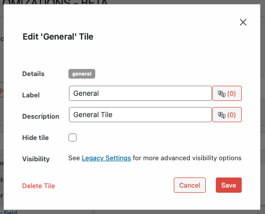

# Modifying Tiles

## Accessing Tile Editing Functionality

`WP Admin > Customizations (D.T) > [Record Type] > Tiles > [Tile] > Edit`

To access the tile editing functionality, follow these steps:

1. Navigate to the WordPress Admin dashboard of your Disciple.Tools instance.
   - Click the settings icon (⚙️ on desktop, ☰ on mobile) and select **Admin**.
2. From the main left sidebar, click on **Customizations (D.T)**.
3. Identify and click on record type to be updated.
4. Navigate to `Tiles` tab.
5. Click the edit pencil button, next to the tile to be modified.

## Edit Tile Workflow

You can update the label and visibility of any tile.

To edit an existing tile:

1. Click on the edit icon next to the tile name in the Customizations menu.
2. Update the tile details as needed:
   - **Label**: Change the display name for the tile.
   - **Description**: Update tile summary description.
   - **Translations**: Click on the translation button next to both label and description fields, to capture different languages. A total count of translations is also provided as part of the button label.
   - **Hide Tile**: Hide the tile from the record details page.
   - **Visibility**: Click on the `Legacy Settings` link to access advanced visibility options.
3. Click **Save Button** to capture changes.

4. Click **Delete Tile** to remove tile from record type.

---

- [Reordering Tiles →](./reordering.md) 