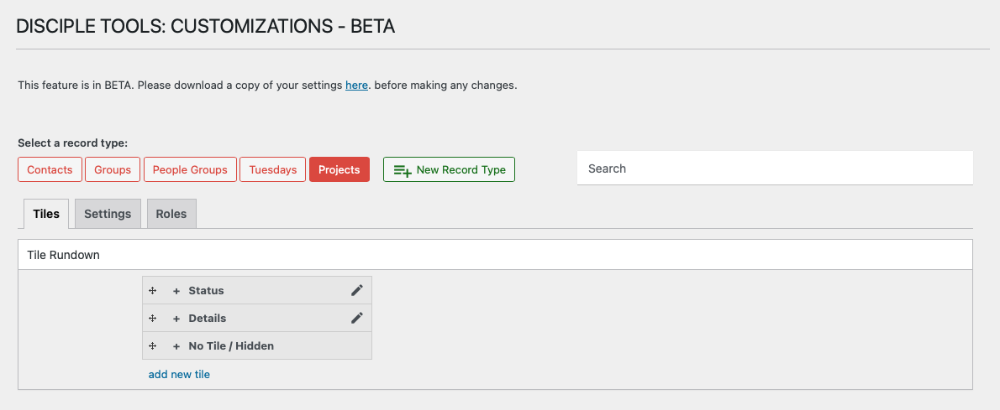

# Tiles Overview

Tiles are sections or boxes that organize fields on a record’s details page in Disciple.Tools. They help group related information, making records easier to read and manage.

## What is a Tile?

A tile is a container for one or more fields. Each record type can have multiple tiles, and each tile can have its own label, icon, and order.

- **Examples:** Personal Info, Contact Details, Group Info, Custom Sections
- Tiles appear as separate sections on the record details page.

## Why Use Tiles?

- Group related fields for better usability
- Customize the layout of each record type
- Make important information easy to find

---

- [Creating a New Tile →](./creating.md) 