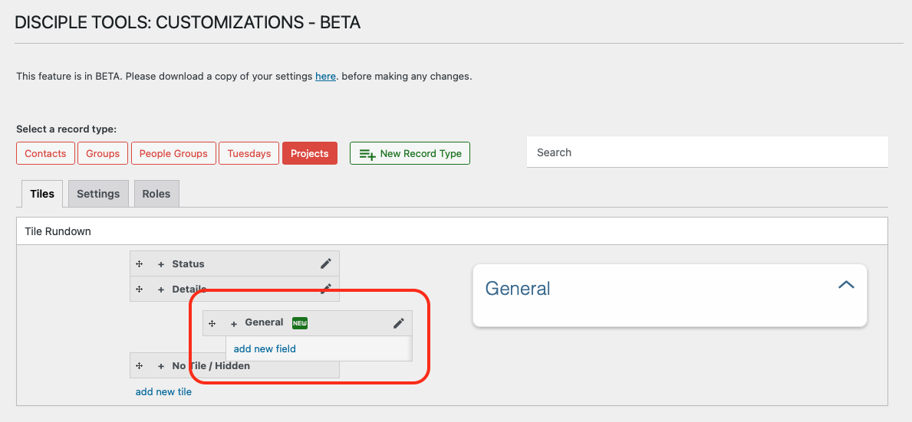

# Reordering Tiles

## Accessing Tile Reordering Functionality

`WP Admin > Customizations (D.T) BETA > [Record Type] > Tiles`

__On Desktop__

1. Access the customizations feature, as described within [Accessing Menu](../accessing-menu.md)
2. Identify and select record type to be updated.
3. Navigate to `Tiles` tab.
4. Drag and drop tiles accordingly to reorder.

__On Mobile__

1. Access the customizations feature, as described within [Accessing Menu](../accessing-menu.md)
2. Identify and select record type to be updated.
3. Navigate to `Tiles` tab.
4. Drag and drop tiles accordingly to reorder.

## Tile Reordering Workflow

You can change the order of tiles to control how information is displayed on the record details page.

To reorder tiles:

1. Hover over a tile to see the drag handle (four-arrow icon).
    - On mobile devices, simply press down on tile panel.
2. Click and hold the drag handle.
3. Drag the tile to the desired position.
4. Release to drop the tile in the new position.

> **Tip:** The order of tiles affects the layout for all users viewing this record type. 